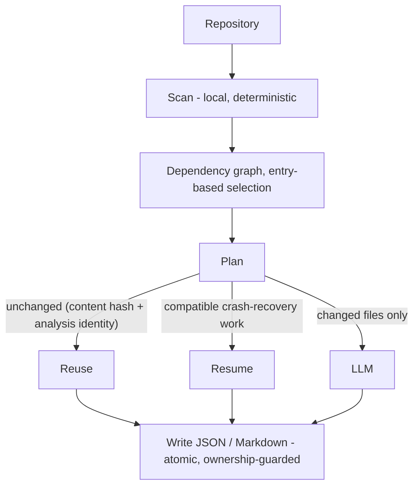

# codedoc-ai

> **codedoc-ai is an incremental documentation engine that treats documentation as
> reusable state instead of regenerating it on every run.** It reprocesses only the
> files whose content or analysis identity changed, so AI-generated documentation
> stays deterministic, crash-safe, and cheap to keep current.

`codedoc-ai` generates structured, incrementally reusable documentation for source
repositories. It scans source locally, builds a deterministic dependency graph,
sends only files that need analysis to a configured LLM, and writes JSON,
Markdown, or both.

## Why codedoc-ai

Most documentation generators run once and regenerate everything from scratch.
codedoc-ai is built as a documentation *memory layer* for AI-assisted
development: it treats documentation as durable, reusable state rather than
throwaway output.

- It documents **incrementally** — only files whose source or analysis identity
  changed are sent to the LLM; everything else is reused.
- Its completed output is **deterministic** — the same inputs produce
  byte-identical documents, with no timestamps to create spurious diffs.
- It is **crash-safe** — an interrupted run resumes from a recovery file instead
  of repeating paid work.
- It **validates ownership** before writing, so it never overwrites a file it
  does not recognize as its own.
- It emits **structured JSON and Markdown** meant to be re-read by both humans
  and tools.

The result is documentation you can regenerate cheaply and trust to stay in sync
with the code, run after run.

## Architecture at a glance



<details>
<summary>Plain-text version (for viewers that don't render Mermaid)</summary>

```text
        repository
            │
            ▼
        scan (local, deterministic)
            │
            ▼
        dependency graph  →  entry-based selection
            │
            ▼
        plan  ─── reuse unchanged (content hash + analysis identity)
            │  ── resume compatible crash-recovery work
            │  ── send only changed files to the LLM
            ▼
        write JSON / Markdown  (atomic, ownership-guarded)
```

</details>

For the full phase-by-phase run lifecycle — including cache and recovery identity
and the failure invariants — see
[RUN_FLOW.md](https://github.com/atharvm416/codedoc-ai/blob/main/RUN_FLOW.md).

## Core design principles

These principles are enforced by the code, not aspirational:

- **Deterministic output** — identical inputs produce byte-identical documents;
  completed output carries no timestamps.
- **Incremental by default** — unchanged files are reused, never re-sent to the
  provider.
- **Fail-closed validation** — unknown configuration, malformed instruction
  profiles, and foreign output files stop the run rather than being silently
  ignored.
- **Minimal cache invalidation** — a change reprocesses only the files it
  actually affects.
- **Explicit ownership** — codedoc-ai overwrites only files it recognizes as its
  own output.
- **Readable output contracts** — completed JSON and Markdown are structured for
  humans, scripts, and AI assistants.
- **Compatibility by validation** — CodeDoc reads recognized CodeDoc documents
  and recovery files, and refuses foreign or malformed artifacts.
- **Config over CLI sprawl** — deep customization lives in `codedoc.config.json`
  (`codedoc --init-config`); the command-line surface stays small.

## Highlights

- Explicit or auto-detected entry files, with `entry` or `all` documentation scope.
- One combined provider call per file by default; optional triple-agent analysis.
- Incremental reuse across JSON and Markdown based on source hashes and analysis
  identity.
- One fixed crash-recovery file that preserves completed work after interruption.
- Config-only, validated instruction customization with mandatory semantic review.
- OpenAI, Anthropic, Gemini, and OpenAI-compatible endpoint support.
- Read-only dry runs, paid-file caps, deterministic ownership guards, and stable
  CI-oriented exit codes.

## Installation

```bash
pip install codedoc-ai
```

## Quick start

Set a provider credential in the process environment, then run CodeDoc:

```bash
export OPENAI_API_KEY="your-key"
codedoc --entry src/main.py
```

PowerShell:

```powershell
$env:OPENAI_API_KEY="your-key"
codedoc --entry src/main.py
```

The default output is `codedoc/codedoc.json`. Common alternatives:

```bash
codedoc --format md
codedoc --format both
codedoc --output docs/report.json
codedoc --documentation-scope all
codedoc --dry-run --max-files 25
```

An entry is optional: CodeDoc can recover it from the selected output,
auto-detect a configured candidate, or document all scanned files when no
candidate exists.

On later runs, CodeDoc reuses unchanged owned records and reprocesses changed
files. If you switch between JSON and Markdown and the requested target does not
yet exist, the exact opposite-format sibling is validated and used as the
conversion source; unchanged files require no provider call.

Empty and whitespace-only source files are skipped before parsing and before
their per-file documentation calls. They are not failures and incur no per-file
provider charge. The run reports them through
`files_skipped_insufficient_source`; if a skipped path had documentation in an
older output, that stale record is omitted from the new completed output.

## Using the output with AI assistants

CodeDoc output is designed to be pasted into, indexed by, or attached to AI
coding assistants. For the strongest results:

- Use `--format both` when humans and tools will read the same run: Markdown is
  easier to skim, while JSON is easier for agents and scripts to query.
- Use `--entry` plus the default `documentation_scope: entry` for application
  flows, CLIs, services, and libraries with a clear starting point.
- Use `--documentation-scope all` for package indexes, SDK-style references, or
  repositories where there is no meaningful entry file.
- Run `codedoc --dry-run --max-files N` before a large or first-time run to see
  how many files would reach the provider.
- Keep `codedoc/codedoc.json` or `codedoc/codedoc.md` in a stable location so
  future runs and AI assistants can compare against the same documentation
  memory.
- Prefer `analysis_mode: single` for fast, economical documentation. Use
  `analysis_mode: triple` when dependency reasoning and role separation matter
  more than provider-call count.

## File contract

CodeDoc automatically manages a deliberately small set of persistent files:

| Phase | Exact file | Purpose |
| --- | --- | --- |
| Configuration | `<project>/codedoc.config.json` | Optional runtime configuration and inline instructions. |
| Active run | `<output>/crash_recovery.json` | In-progress recovery state. |
| Final output | Exact selected `.json`, `.md`, or both | Stable CodeDoc-owned result. |

There is no alternate-config search, external prompt-profile search, prompt
directory, `.env` loading, checkpoint/build/database migration, directory-wide
output discovery, persistent issue log, or managed `.gitignore` behavior. The
only fallback is the deterministic same-name JSON/Markdown counterpart described
below; unrelated files are not opened, migrated, renamed, or deleted.

Temporary atomic-write siblings and writability probes are short-lived
implementation details. They use unique names in the target directory and are
cleaned up best-effort.

### Output formats

| Selection | Stable output | Best use |
| --- | --- | --- |
| `--format json` | `<output>/codedoc.json` or the exact `.json` path supplied to `--output` | Machine-readable project memory for scripts, CI, and AI agents. |
| `--format md` | `<output>/codedoc.md` or the exact `.md` path supplied to `--output` | Human-readable documentation with hidden CodeDoc metadata for reuse. |
| `--format both` | `codedoc.json` and `codedoc.md` inside the selected output directory | One run that serves both tools and humans. |

Supplying `--output docs/report.json` or `--output docs/report.md` selects that
exact file and infers the format from its extension. `--format both` writes two
files and therefore requires an output directory.

### Run metadata

Completed JSON documents contain one canonical run-metadata block: `last_run`.
It includes the entry file, entry source, documentation scope, analysis mode,
scanned/selected counts, and the exact partition of what happened in the most
recent run.

If you are reading a CodeDoc document programmatically, use `last_run` for run
metadata and `files[]` for per-file documentation.

| `last_run` field | Meaning |
| --- | --- |
| `entry_file` | Entry file used for selection, or `null` when no entry was used. |
| `entry_source` | `explicit`, `recovered`, `auto-detected`, or `none`. |
| `documentation_scope` | `entry` or `all`. |
| `analysis_mode` | `single` or `triple`. |
| `files_scanned` | Supported source files found by the scanner. |
| `files_selected` | Files selected for this documentation run. |
| `files_documented_by_llm` | Files successfully documented by the provider in this run. |
| `files_failed` | Selected files that errored in this run. |
| `files_unattempted` | Selected files not attempted after a bounded abort. |
| `files_reused_unchanged` | Files reused because content and analysis identity were unchanged. |
| `files_reused_identical_content` | Files reused from another path with identical content. |
| `files_resumed_from_recovery` | Files restored from compatible crash-recovery state. |

The truthful `last_run` partition is:

```text
files_selected == files_reused_unchanged
                + files_reused_identical_content
                + files_documented_by_llm
                + files_failed
                + files_unattempted
```

The number of file records in the document may be less than
`last_run.files_selected` when a first-run file failed or was unattempted before
any prior record existed. `files_resumed_from_recovery` is a subset of
`files_reused_unchanged`, not a separate partition category.

Every key beginning with `_` inside a `files[]` record is internal to CodeDoc.
External consumers should ignore those keys; they are persisted for cache,
resume, and dependency reuse and are not a stable public contract.

### Ownership markers

Completed `codedoc.json` output is recognized from the strict CodeDoc document
shape: `last_run` with `entry_file` plus the structured `files` collection.
Foreign JSON without that shape is refused before overwrite.

Other CodeDoc-managed artifacts still need internal ownership metadata:

| Document | Ownership marker |
| --- | --- |
| Completed `codedoc.json` | `last_run.entry_file` plus structured `files` |
| `crash_recovery.json` | Internal `_codedoc` recovery metadata |
| `codedoc.md` | Hidden `<!-- codedoc-ai: ... -->` metadata comment |

Completed JSON is the public machine-readable contract. Recovery JSON and
Markdown carry their own internal ownership markers because they serve different
runtime roles.

## Configuration

Generate a complete, valid, editable configuration from the canonical defaults:

```bash
codedoc --init-config
```

This writes `codedoc.config.json` in the current directory. It includes every
public setting, `api_key: null`, and editable versionless single/triple instruction
defaults (`requested_shape` syntax). Credentials are never copied into the file.

Existing targets are refused unless `--force` is supplied. Forced regeneration
validates the existing file and atomically replaces only `prompt_profiles`; every
other top-level setting and value is preserved, and no backup is created. CodeDoc
reads subsequent edits from this exact active file.

Useful defaults include:

| Setting | Default |
| --- | --- |
| `llm_provider` | `auto` |
| `model_name` | provider default |
| `documentation_scope` | `entry` |
| `analysis_mode` | `single` |
| `output_dir` | `codedoc` |
| `output_format` | `json` |
| `max_parallel_files` | `5` |
| `file_retry_attempts` | `1` |
| `max_file_size_kb` | `500` |
| `max_content_chars` | `12000` |
| `follow_symlinks` | `false` |
| `propagate_changes` | `true` |
| `rate_limit_adaptive` | `true` |
| `response_correction_enabled` | `false` |

Run `codedoc --init-config` rather than copying a partial example when you need
the complete current key set.

### Response correction (opt-in)

Provider responses must satisfy a deterministic JSON contract: the requested
keys, the requested types, a non-empty value for every required field, and at
least one usable requested field. A response that fails the contract is rejected
with a bounded, structured diagnostic.

Response correction is **disabled by default**. Set
`"response_correction_enabled": true` to opt into at most **one** targeted
correction call per failed agent response — a single extra paid provider call
that asks the model to repair the response to the exact schema, preserving valid
facts and inventing nothing.

- With correction **off** (the default), a rejected response is **not** silently
  converted into a whole-file retry; the file fails once, at its initial call.
- With correction **on**, one repair call is made for that agent response; if the
  repair also fails the contract, the file fails without a further retry.
- Correction is **not** a factuality bypass. Malformed output or a missing or
  empty required field can still fail a file whether correction is on or off.
- `file_retry_attempts` remains the policy for transport, rate-limit, and other
  recoverable failures; it is unaffected by response correction.
- At `--verbose` (`log_level: DEBUG`), diagnostics add only bounded structural
  metadata (removed field paths and reason codes, returned value types, a parse
  position, a response character count). No raw provider-response text, source,
  prompt, or credential is ever logged.

## Command-line options

| Flag | Purpose |
| --- | --- |
| `--entry FILE` | Select an entry file; otherwise recover or auto-detect one. |
| `--documentation-scope {entry,all}` | Document entry-reachable files or all scanned files. |
| `--provider NAME` | Select `auto`, `openai`, `anthropic`, or `gemini`. |
| `--model MODEL` | Override the provider model. |
| `--output PATH` | Select an output directory or exact `.json`/`.md` file. |
| `--format {json,md,both}` | Select output format. |
| `--ignore PATH` | Add a project-relative ignored path; repeatable. |
| `--skip-dirs DIRS` | Replace default skipped directory names with a comma-separated list. |
| `--add-skip-dir DIR` | Add a skipped directory name; repeatable. |
| `--remove-skip-dir DIR` | Remove a default skipped directory name; repeatable. |
| `--dry-run` | Plan without writes or provider calls. |
| `--max-files N` | Cap files allowed to make documentation calls (`0` is unlimited). |
| `--force-files FILE` | Reprocess a selected path even when unchanged; repeatable. |
| `--allow-partial` | Exit zero after a completed run with file failures. |
| `--no-parallel` | Disable within-file parallel agents in triple mode. |
| `--analysis-mode {single,triple}` | Select one combined call or the three-agent path. |
| `--init-config` | Create the complete active config and exit. |
| `--force` | With `--init-config`, refresh only editable profiles. |
| `--max-parallel-files N` | Set concurrent file processing (default `5`). |
| `--truncation-head-ratio FLOAT` | Set the head/tail source truncation split. |
| `--verbose`, `-v` | Enable debug logging. |
| `--version` | Print the installed version and exit. |

Ignore rules are resolved from `--ignore`/`ignore_paths` and the
`--skip-dirs`/`--add-skip-dir`/`--remove-skip-dir` family. Paths are
project-relative; skip-directory values are directory names.

## Providers and environment variables

Credentials and ordinary scalar overrides may come from operating-system
environment variables. CodeDoc does not read `.env` files.

| Variable | Purpose |
| --- | --- |
| `OPENAI_API_KEY` | OpenAI credential. |
| `ANTHROPIC_API_KEY` | Anthropic credential. |
| `GEMINI_API_KEY` / `GOOGLE_API_KEY` | Gemini credential. |
| `LLM_API_KEY` | Generic fallback credential. |
| `LLM_PROVIDER` | `auto`, `openai`, `anthropic`, or `gemini`. |
| `MODEL_NAME` | Provider model name. |
| `API_BASE_URL` | OpenAI-compatible endpoint base URL. |
| `OUTPUT_DIR` | Output directory or exact output file. |
| `CODEDOC_OUTPUT_FORMAT` | `json`, `md`, or `both`. |
| `LOG_LEVEL` | `DEBUG`, `INFO`, `WARNING`, or `ERROR`. |
| `CODEDOC_IGNORE_PATHS` | Semicolon-separated project-relative paths to ignore. |
| `CODEDOC_MAX_PARALLEL_FILES` | File concurrency. |
| `CODEDOC_FILE_RETRY_ATTEMPTS` | Per-file retry attempts. |
| `CODEDOC_MAX_CONSECUTIVE_FAILURES` | Consecutive-failure abort threshold. |
| `CODEDOC_MAX_CONTENT_CHARS` | Per-file prompt content ceiling. |
| `CODEDOC_DRY_RUN` | Planning-only mode. |
| `CODEDOC_MAX_FILES` | Paid-file cap (`0` means unlimited). |
| `CODEDOC_FORCE_FILES` | Semicolon-separated project-relative paths. |
| `CODEDOC_ALLOW_PARTIAL` | Allow a completed partial run to exit zero. |
| `CODEDOC_ANALYSIS_MODE` | `single` or `triple`. |
| `CODEDOC_TRUNCATION_HEAD_RATIO` | Head fraction for source truncation. |

Provider defaults are OpenAI `gpt-4o-mini`, Anthropic
`claude-haiku-4-5-20251001`, and Gemini `gemini-2.5-flash`. Select explicitly with
`--provider` and `--model`, or use `auto` with a recognized model prefix.

## Inline instructions

The only runtime instruction source is `prompt_profiles` inside the exact
`codedoc.config.json` (or an in-memory Python override). Generated profiles are
versionless and use `requested_shape`.

Every present mode uses a required `common` envelope and an optional
`per_extension` complete replacement, keyed by file extension:

```json
{
  "prompt_profiles": {
    "single": {
      "common": {
        "requested_shape": {
          "description": "Explain what this file does.",
          "role_in_system": "Explain its architectural role."
        }
      },
      "per_extension": {
        ".js": {
          "requested_shape": {
            "description": "Explain this JavaScript module for a reviewer."
          }
        }
      }
    }
  }
}
```

Triple mode carries all three agent keys inside each `per_extension` override
(complete replacement), and a non-empty `triple.per_extension` requires
`triple.common.documentation`:

```json
{
  "prompt_profiles": {
    "triple": {
      "common": {
        "structure": { "requested_shape": { } },
        "dependency": { "requested_shape": { } },
        "documentation": { "requested_shape": { } }
      },
      "per_extension": {
        ".cs": {
          "structure": { "requested_shape": { } },
          "dependency": { "requested_shape": { } },
          "documentation": { "requested_shape": { } }
        }
      }
    }
  }
}
```

**Extension resolution.** For each file the effective block is chosen by
`longest matching per_extension > common > built-in default`. Matching is on the
file's lowercased **basename**, so multi-part suffixes work and the longest match
wins: `.d.ts` beats `.ts` for `types.d.ts`, and matching is case-insensitive
(`Types.D.TS` selects `.d.ts`). A file whose entire name is `.ts` is not treated
as a `.ts`-suffixed file. An override is a **complete replacement** of the block,
never a field-by-field merge. Each `per_extension` key must be a lowercase dotted
suffix whose final segment is one of the project's configured extensions (from
`extension_language_map`); `.pyy` is rejected when only `.py` is configured, which
prevents silently dead overrides. An entry that matches no scanned file is
validated but costs nothing — it renders no prompt, makes no review call, and
invalidates no cache. Editing a used override reprocesses only the files whose
basename resolves to it; files that fall back to an unchanged `common` stay
reusable.

Unsupported profile layouts are rejected with targeted guidance.

`analysis_mode: single` exposes one combined editable instruction JSON at
`single.common`. Triple mode exposes three independently editable instruction
JSON blocks at `triple.common.structure`, `.dependency`, and `.documentation`.
Supported field order, optional fields, and bounded instruction text are editable;
fixed system, safety, factuality, scanning, retry, cache, and serialization rules
are not. `per_extension` remains a complete-block replacement.

An effective non-default instruction is reviewed only when it will reach a planned
LLM documentation call. `SAFE` continues, `RISKY` requires explicit per-run
confirmation, and `TOO_RISKY` always stops. Initialization, unedited defaults,
dry runs, cache-only work, and deterministic JSON↔Markdown conversion make no
security-review call. There is no stored bypass.
CodeDoc also computes deterministic, non-blocking feasibility advisories when a
custom field appears to require cross-file context that a per-file pass cannot
see. These advisories are provider-free, appear in dry-run and real-run summaries,
never block a run, and never change the standards/safety review verdict.
Fixed system roles, factuality/safety rules, parser facts, cleaners, provider
selection, scanning, retry, cache, ownership, and artifact serialization are not
customizable.

Use `codedoc --init-config` as the registry-backed reference for exact fields,
types, and complete defaults.

## Output, incremental reuse, and ownership

In a single-format run, an existing requested target is authoritative. If it is
missing, CodeDoc may strictly validate and reuse only its exact opposite-format
sibling: `codedoc.json` pairs with `codedoc.md`, and a named
`docs/report.json` pairs only with `docs/report.md`. Unchanged compatible records
are converted without provider calls; changed, forced, missing, or
cache-incompatible files are documented normally. The sibling is read-only and
only the requested format is written.

A present fallback that is foreign or malformed blocks before provider contact
instead of silently starting a paid fresh run. No directory walk, modification-
time choice, unrelated default filename, or extra candidate is used. Entry
recovery remains tied to the selected output; when it is absent, ordinary source
entry auto-detection runs.

Both mode reads its exact two targets and blocks before provider contact if
entry, path set, hashes, or cache identity disagree. When only one valid target
exists, it supplies the records used to create both outputs.

CodeDoc refuses to overwrite foreign, empty, or malformed final targets. Custom
output names remain supported when supplied explicitly:

```bash
codedoc --output docs/report.json
codedoc --output docs/report.md
```

`--format both` requires a directory because it writes two files.

## Crash recovery

Every real run uses exactly `<output_dir>/crash_recovery.json`. The file is
created only after ownership/path checks, deterministic validation, read-only
planning, paid caps, and any mandatory semantic review have succeeded. It is
updated atomically after each completed file.

The recovery file includes a versioned identity covering project root, exact
selected targets, entry, documentation scope, and analysis mode/revision. It no
longer binds a profile-wide digest: each recovered completed record is instead
re-validated individually against the current per-file `_prompt_profile_digest`,
so an unrelated profile edit or a newly added file no longer discards a resumable
run. A compatible in-progress file is resumed. A foreign, malformed, completed,
unsupported, or identity-mismatched file blocks without mutation. To start fresh,
delete `crash_recovery.json` in the output directory; to resume, restore the
prior run configuration.

On success, final output is atomically replaced first and recovery is removed
second. Interruptions, provider failures, and final-output failures preserve the
stable prior output and the recovery file. Dry-run may inspect the exact recovery
path but never creates, changes, or deletes it.

## Planning and diagnostics

`--dry-run` performs scanning and planning without persistent mutation, provider
creation, or API calls. It reports empty/whitespace-only files separately and
excludes their expected documentation calls and prompt tokens. `--max-files N`
remains a conservative cap over pre-gate documentation-call candidates, while
dry-run also shows how many candidates would actually reach documentation calls
after its read-only source snapshot. `--force-files PATH` bypasses reuse for a
selected file.

Issues are bounded in memory, printed to the terminal, and included in permitted
final/recovery metadata. CodeDoc does not write `error.log`.

Exit codes:

| Code | Meaning |
| --- | --- |
| `0` | Success, dry-run success, or explicitly allowed completed partial output. |
| `1` | Processing/output failure or bounded rate-limit stop. |
| `2` | Invalid input/config/path, ownership/recovery conflict, cap failure, or terminal provider failure. |
| `130` | Keyboard interrupt. |

## Python API

```python
from codedoc import run_pipeline

stats = run_pipeline({
    "entry_file": "src/main.py",
    "output_format": "json",
    "max_parallel_files": 3,
})

stats = run_pipeline("/path/to/project", {"output_format": "both"})
```

In-memory overrides are supported but do not create another persistent config
source. Unsupported settings such as external prompt paths, risky-review bypass,
safe mode, and managed output ignore files raise targeted configuration errors.

## Troubleshooting

- Missing credential: set the matching provider environment variable.
- Unexpected paid work: run the identical command with `--dry-run` and inspect
  the exact output selection and analysis mode.
- Recovery conflict: follow the error’s expected/found field, then restore the
  prior configuration or delete the exact `crash_recovery.json` to start fresh.
- Missing files: check entry selection, `documentation_scope`, `skip_dirs`,
  `ignore_paths`, `extension_language_map`, and `max_file_size_kb`.
- Rate limits: lower `max_parallel_files`; adaptive stepping is enabled by default.

## License

See [LICENSE](https://github.com/atharvm416/codedoc-ai/blob/main/LICENSE).
