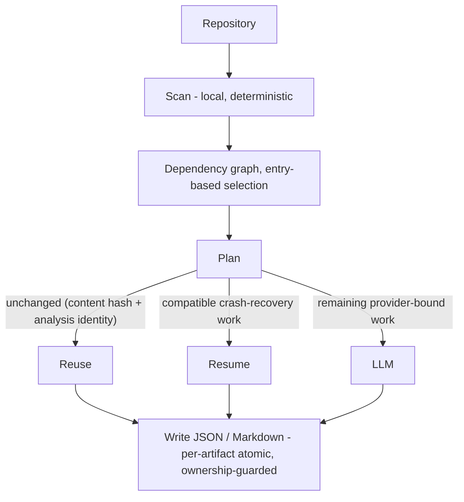
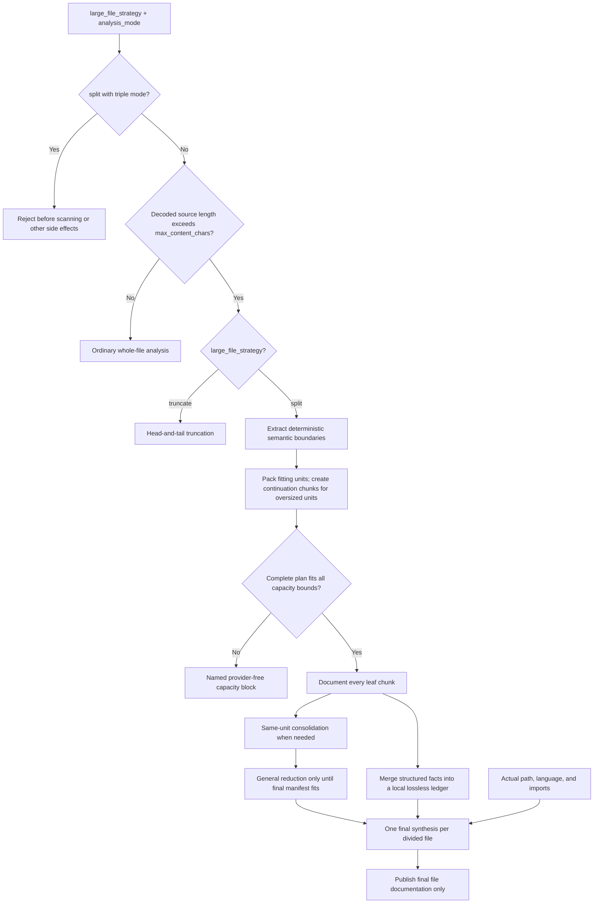

# codedoc-ai

> **codedoc-ai is an incremental documentation engine that treats documentation as
> reusable state instead of regenerating it on every run.** It reuses compatible
> completed records and recovery checkpoints, then sends only the remaining
> provider-bound work to the configured LLM.

`codedoc-ai` generates structured, incrementally reusable documentation for source
repositories. It scans source locally, builds a deterministic dependency graph,
sends only files that need analysis to a configured LLM, and writes JSON,
Markdown, or both.

## Contents

- [Why codedoc-ai](#why-codedoc-ai)
- [Architecture at a glance](#architecture-at-a-glance)
- [Core design principles](#core-design-principles)
- [Highlights](#highlights)
- [Installation](#installation)
- [Quick start](#quick-start)
- [Using the output with AI assistants](#using-the-output-with-ai-assistants)
- [File contract](#file-contract)
- [Configuration](#configuration)
  - [Configuration reference](#configuration-reference)
  - [Large files](#large-files)
  - [Response correction](#response-correction-opt-in)
- [Command-line options](#command-line-options)
- [Providers and environment variables](#providers-and-environment-variables)
- [Inline instructions](#inline-instructions)
- [Output, incremental reuse, and ownership](#output-incremental-reuse-and-ownership)
- [Crash recovery](#crash-recovery)
- [Planning and diagnostics](#planning-and-diagnostics)
- [Python API](#python-api)
  - [Offline format conversion](#offline-format-conversion)
  - [Exported Python surface](#exported-python-surface)
- [Troubleshooting](#troubleshooting)

## Why codedoc-ai

Most documentation generators run once and regenerate everything from scratch.
codedoc-ai is built as a documentation *memory layer* for AI-assisted
development: it treats documentation as durable, reusable state rather than
throwaway output.

- It documents **incrementally** — compatible records are reused; new, forced,
  changed, and cache-incompatible records go through provider-free planning
  before any remaining work reaches the LLM.
- Its **local assembly is deterministic** — given the same completed records,
  graph, and run statistics, serialization produces the same bytes and adds no
  run-varying timestamp. Provider responses themselves are not assumed to be
  deterministic.
- It is **crash-safe** — a compatible interrupted ordinary run can reuse
  completed records, reducing repeated provider work.
- It **validates final-output ownership** before replacement, so a foreign final
  target is refused.
- It emits **structured JSON and Markdown** meant to be re-read by both humans
  and tools.

The result is documentation that can be refreshed without paying again for
records that still satisfy the current reuse contract.

## Architecture at a glance



<details>
<summary>Plain-text version (for viewers that don't render Mermaid)</summary>

```text
        repository
            │
            ▼
        scan (local, deterministic)
            │
            ▼
        dependency graph  →  entry-based selection
            │
            ▼
        plan  ─── reuse compatible records (content hash + analysis identity)
            │  ── resume compatible crash-recovery work
            │  ── send remaining provider-bound work to the LLM
            ▼
        write JSON / Markdown  (per-artifact atomic, ownership-guarded)
```

</details>

For the full phase-by-phase run lifecycle — including cache and recovery identity
and the failure invariants — see
[RUN_FLOW.md](https://github.com/atharvm416/codedoc-ai/blob/main/RUN_FLOW.md).

## Core design principles

These principles are enforced by the code, not aspirational:

- **Deterministic local output assembly** — identical completed records, graph,
  and run statistics serialize byte-identically; completed output carries no
  run-varying timestamp.
- **Incremental by default** — records whose content hash and complete cache
  identity remain reusable do not require another provider call.
- **Fail-closed validation** — unknown configuration, malformed instruction
  profiles, and foreign output files stop the run rather than being silently
  ignored.
- **Centralized cache identity** — every registered cache-identity key is checked
  by one reuse predicate; a mismatched record is not silently reused.
- **Explicit ownership** — final and recovery artifacts are replaced only after
  CodeDoc recognizes their ownership metadata.
- **Readable output contracts** — completed JSON and Markdown are structured for
  humans, scripts, and AI assistants.
- **Compatibility by validation** — CodeDoc reads recognized CodeDoc documents
  and recovery files, and refuses foreign or malformed artifacts.
- **Config over CLI sprawl** — deep customization lives in `codedoc.config.json`
  (`codedoc --init-config`); the command-line surface stays small.

## Highlights

- Explicit or auto-detected entry files, with `entry` or `all` documentation scope.
- One initial combined call for an ordinary file in the default single mode;
  optional triple-agent analysis, retries, correction, and split planning have
  their own explicit accounting.
- Incremental reuse across JSON and Markdown based on source hashes and analysis
  identity.
- One fixed crash-recovery file that preserves completed work after interruption.
- Opt-in, provider-free complete-source division planning for oversized files.
- Config-only, validated instruction customization; non-default blocks that will
  reach provider work undergo the mandatory semantic review.
- OpenAI, Anthropic, Gemini, and OpenAI-compatible endpoint support.
- Read-only dry runs, paid-file caps, deterministic ownership guards, and stable
  CI-oriented exit codes.

## Installation

```bash
pip install codedoc-ai
```

## Quick start

Set a provider credential in the process environment, then run CodeDoc:

```bash
export OPENAI_API_KEY="your-key"
codedoc --entry src/main.py
```

PowerShell:

```powershell
$env:OPENAI_API_KEY="your-key"
codedoc --entry src/main.py
```

The default output is `codedoc/codedoc.json`. Common alternatives:

```bash
codedoc --format md
codedoc --format both
codedoc --output docs/report.json
codedoc --documentation-scope all
codedoc --dry-run --max-files 25
```

An entry is optional: CodeDoc can recover it from the selected output,
auto-detect a configured candidate, or document all scanned files when no
candidate exists.

On later runs, CodeDoc reuses compatible owned records and replans new, changed,
forced, or cache-incompatible files. If you switch between JSON and Markdown and
the requested target does not yet exist, the exact opposite-format sibling is
validated and used as the conversion source; reusable files require no provider
call.

Empty and whitespace-only source files are identified during provider-free
planning and skipped before their per-file documentation calls. They are not
failures and incur no per-file provider charge. The run reports them through
`files_skipped_insufficient_source`; if a skipped path had documentation in an
older output, that stale record is omitted from the new completed output.

## Using the output with AI assistants

CodeDoc output is designed to be pasted into, indexed by, or attached to AI
coding assistants. For the strongest results:

- Use `--format both` when humans and tools will read the same run: Markdown is
  easier to skim, while JSON is easier for agents and scripts to query.
- Use `--entry` plus the default `documentation_scope: entry` for application
  flows, CLIs, services, and libraries with a clear starting point.
- Use `--documentation-scope all` for package indexes, SDK-style references, or
  repositories where there is no meaningful entry file.
- Run `codedoc --dry-run --max-files N` before a large or first-time run to see
  how many files would reach the provider.
- Keep `codedoc/codedoc.json` or `codedoc/codedoc.md` in a stable location so
  future runs and AI assistants can compare against the same documentation
  memory.
- Prefer `analysis_mode: single` for fast, economical documentation. Use
  `analysis_mode: triple` when dependency reasoning and role separation matter
  more than provider-call count.

## File contract

CodeDoc uses a deliberately small set of persistent files:

| Phase | Exact file | Purpose |
| --- | --- | --- |
| Configuration | `<project>/codedoc.config.json` | Optional runtime configuration and inline instructions. |
| Active run | `<resolved-output-directory>/crash_recovery.json` | In-progress recovery state. |
| Final output | Exact selected `.json`, `.md`, or both | Stable CodeDoc-owned result. |

The only persistent runtime configuration file is the exact project-root
`codedoc.config.json`; defaults, environment values, CLI arguments, and
in-memory overrides participate in normal resolution without adding another
config file. Stable reuse reads only the selected final target, or its exact
same-stem opposite-format sibling when the selected target is absent. Recovery
uses only the fixed path above. CodeDoc does not search the output directory
for alternate filenames or recovery candidates.

Temporary atomic-write siblings and writability probes are short-lived
implementation details. They use unique names in the target directory, are
cleaned up best-effort, and provide per-artifact atomic replacement rather than
a cross-file transaction.

### Output formats

| Selection | Stable output | Best use |
| --- | --- | --- |
| `--format json` | `<output>/<output_json_filename>` (default `codedoc.json`) or the exact `.json` path supplied to `--output` | Machine-readable project memory for scripts, CI, and AI agents. |
| `--format md` | `<output>/<output_md_filename>` (default `codedoc.md`) or the exact `.md` path supplied to `--output` | Human-readable documentation with hidden CodeDoc metadata for reuse. |
| `--format both` | The configured JSON and Markdown filenames inside the selected output directory | One run that serves both tools and humans. |

Supplying `--output docs/report.json` or `--output docs/report.md` selects that
exact file and infers the format from its extension. `--format both` writes two
files and therefore requires an output directory.

### Run metadata

Completed JSON documents contain one canonical run-metadata block: `last_run`.
It includes the entry file, entry source, documentation scope, analysis mode,
scanned/selected counts, and the exact partition of what happened in the most
recent run.

If you are reading a CodeDoc document programmatically, use `last_run` for run
metadata and `files[]` for per-file documentation.

| `last_run` field | Meaning |
| --- | --- |
| `entry_file` | Entry file used for selection, or `null` when no entry was used. |
| `entry_source` | `explicit`, `recovered`, `auto-detected`, or `none`. |
| `documentation_scope` | `entry` or `all`. |
| `analysis_mode` | `single` or `triple`. |
| `files_scanned` | Supported source files found by the scanner. |
| `files_selected` | Files selected for this documentation run. |
| `files_documented_by_llm` | Files completed through current-run provider documentation accounting. |
| `files_failed` | Selected files that errored in this run. |
| `files_unattempted` | Selected files not attempted after a bounded abort. |
| `files_skipped_insufficient_source` | Empty or whitespace-only selected files rejected locally without a provider call. |
| `files_reused_unchanged` | Files reused because content and analysis identity were unchanged. |
| `files_reused_identical_content` | Files reused because their own same-path prior record has identical content and matching identity. |
| `files_resumed_from_recovery` | Files restored from compatible crash-recovery state. |
| `split_completed_files_reused` | Same-path completed split records reused with no split execution. |
| `split_partial_files_resumed` | Split files with at least one validated retained node. |
| `split_unpaid_nodes` | Exact initially planned unpaid leaf, reducer, and final nodes. |
| `split_reexecuted_nodes` | Previously paid split nodes scheduled again after invalidation. |
| `split_quarantined_nodes` | Bounded non-executable rejected-node entries retained in recovery. |
| `split_recovery_conflict_files` | Split files containing a bounded recovery conflict. |

The truthful `last_run` partition is:

```text
files_selected == files_reused_unchanged
                + files_reused_identical_content
                + files_documented_by_llm
                + files_failed
                + files_unattempted
                + files_skipped_insufficient_source
```

The number of file records in the document may be less than
`last_run.files_selected` when a first-run file failed, was locally skipped, or
was unattempted before any prior record existed.
`files_resumed_from_recovery` is an overlapping provenance count, not a separate
partition category: a restored completed record can be classified as reused.

Ordinary identical-content reuse (`files_reused_identical_content`) is same-path
only: a record documents exactly its own path, and CodeDoc never copies
documentation from one path to a different path even when their content is
byte-identical. The first run after upgrading to `0.14.4` regenerates every
ordinary and truncate-strategy record once, under the corrected same-path-bound
identity, which raises that run's `total_calls_planned`. `max_planned_calls` is
evaluated against the complete selected run before usage accounting, provider
creation, or any confirmation callback, so an exceeded cap blocks the entire run
rather than throttling it — this one-time regeneration cannot be spread across
runs under one unchanged cap. To span it across runs instead, select a smaller
scope (a narrower `--entry`, additional `--ignore` paths, or a reduced
`--documentation-scope`), or let individual file failures leave the remainder
for a later run.

Every key beginning with `_` inside a `files[]` record is internal to CodeDoc.
External consumers should ignore those keys; they are persisted for cache,
resume, and dependency reuse and are not a stable public contract.

### Ownership markers

Completed JSON output is recognized only after strict CodeDoc document
validation. Current versionless output requires a canonical `last_run` object
containing `entry_file`; `files`, when present, must be a list of structured
records. Supported legacy CodeDoc shapes remain readable through their own
validation path. Foreign JSON is refused before overwrite.

Other CodeDoc-managed artifacts still need internal ownership metadata:

| Document | Ownership marker |
| --- | --- |
| Completed JSON | Validated current or supported legacy CodeDoc document shape |
| `crash_recovery.json` | Internal `_codedoc` recovery metadata |
| `codedoc.md` | Hidden `<!-- codedoc-ai: ... -->` metadata comment |

Completed JSON is the public machine-readable contract. Recovery JSON and
Markdown carry their own internal ownership markers because they serve different
runtime roles. JSON-to-Markdown, Markdown-to-JSON, embedded-view reads, and
direct public-view rendering all apply the same recursive public projection
before deriving visible or lightweight metadata, so private split provenance
cannot influence or escape through a format conversion.

## Configuration

Generate a complete, valid, editable configuration from the canonical defaults:

```bash
codedoc --init-config
```

This writes `codedoc.config.json` in the current directory. It includes every
generated setting, `api_key: null`, and editable versionless single/triple
instruction defaults (`requested_shape` syntax). Initialization does not copy a
credential from the environment into the file.

Existing targets are refused unless `--force` is supplied. Forced regeneration
validates the existing file and atomically replaces only `prompt_profiles`; every
other top-level setting and value is preserved, and no backup is created. CodeDoc
reads subsequent edits from this exact active file.

### Configuration reference

Every key emitted by `codedoc --init-config` is listed below. Run
`codedoc --init-config` for the exact defaults, value types, and editable
instruction schema instead of copying a partial configuration.

| Setting | Purpose |
| --- | --- |
| `llm_mode` | Select the LLM mode; only `api` is supported. |
| `llm_provider` | Select `auto`, `openai`, `anthropic`, or `gemini`. |
| `model_name` | Select a model; an empty value uses the provider default. |
| `api_base_url` | Set a custom OpenAI-compatible endpoint, or `null`. A non-null value also requires runtime endpoint-trust approval — see [Custom endpoints and endpoint-trust approval](#custom-endpoints-and-endpoint-trust-approval); this key alone never authorizes sending anything to that endpoint. |
| `api_key` | Set a credential override; generated config keeps this `null`, and credentials should normally be supplied through environment variables. |
| `entry_file` | Set a project-relative entry file, or `null` for recovery or auto-detection. |
| `documentation_scope` | Select entry-reachable files with `entry` or all scanned files with `all`. |
| `output_dir` | Set an output directory or a path ending in `.json` or `.md`. |
| `output_format` | Select `json`, `md`, or `both`. |
| `output_json_filename` | Set the JSON filename used for directory output. |
| `output_md_filename` | Set the Markdown filename used for directory output. |
| `parallel_agents` | Run structure and dependency agents concurrently in triple mode. |
| `max_parallel_files` | Limit concurrent file processing. |
| `file_retry_attempts` | Set per-file retries for recoverable failures. |
| `max_consecutive_failures` | Abort after this many consecutive file failures. |
| `log_level` | Select `DEBUG`, `INFO`, `WARNING`, or `ERROR`. |
| `max_file_size_kb` | Skip files larger than this size. |
| `follow_symlinks` | Follow symlinked files and directories while scanning. |
| `propagate_changes` | Include selected dependents in change routing before the normal reusable-record checks. |
| `rate_limit_adaptive` | Step file concurrency down when rate limits occur. |
| `parallel_ladder` | Replace the adaptive concurrency ladder, or use `null` for the default. |
| `respect_retry_after` | Honor a provider `Retry-After` hint. |
| `retry_after_cap_s` | Cap the number of seconds honored from `Retry-After`. |
| `skip_dirs` | Replace the directory-name skip list. |
| `skip_dirs_add` | Add names to the resolved directory skip list. |
| `skip_dirs_remove` | Remove names from the resolved directory skip list. |
| `extension_language_map` | Replace the extension-to-language map used for scanning. |
| `extension_language_map_add` | Add or replace extension-to-language entries. |
| `extension_language_map_remove` | Remove extensions from the resolved language map. |
| `auto_entry_candidates` | Replace the filenames tried during entry auto-detection. |
| `auto_entry_candidates_add` | Add filenames to the resolved entry-candidate list. |
| `auto_entry_candidates_remove` | Remove filenames from the resolved entry-candidate list. |
| `provider_prefixes` | Replace provider-to-model-prefix mappings used by auto-detection and credential lookup. |
| `provider_prefixes_add` | Add provider model prefixes. |
| `provider_prefixes_remove` | Remove provider model prefixes. |
| `rate_limit_backoff_s` | Override the global minimum rate-limit backoff, or use `null`. |
| `rate_limit_backoff_scale` | Override the global backoff scale, or use `null`. |
| `rate_limit_signals_add` | Add error-message signals recognized as rate limits. |
| `rate_limit_signals_remove` | Remove recognized rate-limit signals. |
| `ignore_paths` | Set project-relative paths to ignore. |
| `max_content_chars` | Set the ordinary source ceiling and the ceiling for each split leaf, reduction manifest, and final manifest. |
| `large_file_strategy` | Choose head-and-tail `truncate` handling or complete-source `split` planning, execution, completed reuse, and node recovery. |
| `dry_run` | Plan without writes, provider construction, or provider calls. |
| `max_files` | Cap files with unpaid provider work; `0` is unlimited. |
| `max_planned_calls` | Cap initially planned LLM calls before provider construction; `0` is unlimited. |
| `force_files` | Reprocess selected project-relative paths even when unchanged. |
| `allow_partial` | Exit successfully after a completed run that contains file failures. |
| `analysis_mode` | Choose the initial combined `single` path or the three-agent `triple` path for an ordinary file. |
| `truncation_head_ratio` | Set the head fraction of head-and-tail truncation. |
| `response_correction_enabled` | Opt into one targeted correction call for an eligible rejected response. |
| `prompt_profiles` | Customize inline single/triple requested output shapes. |

`supported_extensions` is not emitted by `--init-config`. The loader accepts an
explicit non-default value only as a backward-compatibility filter over the
resolved `extension_language_map`, then derives `supported_extensions` from that
map. New configurations should use `extension_language_map`. For list and map
families, the base key replaces the default while matching `_add` and `_remove`
keys adjust the resolved value.

### Custom endpoints and endpoint-trust approval

Setting `api_base_url` (in `codedoc.config.json`, `API_BASE_URL`, or an
in-memory `config_overrides`) routes every provider call for that run to that
endpoint instead of the default provider endpoint — which means your API key,
your project's source, and every prompt built from it are sent there once the
run is authorized. Because a project-controlled config file could otherwise
redirect this traffic with no runtime decision by the user, a non-empty
`api_base_url` additionally requires runtime endpoint-trust approval from
exactly two sources, evaluated before any credential is read:

- the `--trust-api-base-url URL` CLI option, or
- the `CODEDOC_TRUST_API_BASE_URL` environment variable.

`--trust-api-base-url` wins when both are set. Approval is compared to the
configured `api_base_url` as a canonical identity — scheme, lowercased host,
port (defaulted per scheme when omitted), and path with trailing slashes
stripped — so the approval URL does not need to be byte-identical, only
equivalent, and it must not carry a username, password, query string, or
fragment (neither may `api_base_url` itself); any of those is rejected.
Approving an endpoint while `api_base_url` is unset is also rejected, so a
stale approval can never sit unnoticed in the environment.

`codedoc.config.json` and `config_overrides` can never satisfy this gate —
setting a `trust_api_base_url`-shaped key there is rejected outright — so
approval is always a deliberate, runtime, per-invocation decision, and it
applies identically to `--dry-run`. A refused run creates no provider, sends
no request, and never prints the raw endpoint URL, the approval URL, or any
credential; it identifies the endpoint only by its canonical digest.

```bash
codedoc --entry src/main.py --trust-api-base-url http://localhost:11434/v1
```

### Large files

#### Reuse and recovery boundary

The default `large_file_strategy: truncate` keeps the established head-plus-tail
behavior. With `analysis_mode: single`, `large_file_strategy: split` supports
both provider-free dry-run planning and real execution over the complete source.
Any `triple + split` request fails configuration validation before scanning,
recovery inspection, output-directory creation, prompt review, or provider
construction; it never silently falls back to truncation.

Completed split reuse and node-level partial recovery begin in `0.14.2`. As of
`0.14.3`, `single + split` execution, completed-record reuse, and node-level
recovery are fully supported; `triple + split` remains unavailable. An
exactly compatible same-path completed split record is reused without provider
construction, review calls, documentation calls, partial writes, or paid-cap
usage. Cross-path identical-content split reuse remains unavailable because the
split plan and completed identity are path-bound. An explicit force bypasses
reuse and recovery for that path while preserving prior stable output and
recovery until replacement succeeds.

Split leaf signatures are private, internal matching metadata only — never
part of any public schema. They are bounded to the parser-aligned
600-character ceiling; a model-returned signature over that bound fails
through the normal correction/failure contract and is never silently
truncated into a shortened accepted value.

Each accepted leaf, reduction, and final-synthesis result is checkpointed only
after it has been cleaned and validated. A compatible interrupted run resumes
only unpaid nodes in dependency order. Schema-1 and schema-2 partial state is
recognized and preserved but not resumed; unknown, foreign, aliased, duplicate,
or otherwise unsafe containers block with preserve-first guidance. Move an
incompatible recovery file aside to retain it for diagnosis or a matching
version; deletion is an explicit discard of that state.

The current node-keyed recovery generation is schema 4 (`0.14.3`, bound to the
`leaf-capsule-v6` leaf identity). Released schema 3 (`0.14.2`,
`leaf-capsule-v5`) is now an unsupported predecessor generation, preserved
and blocked exactly like schema-1/schema-2 state: a real `0.14.3` run rejects
it on its container schema version alone, before any node is read, before
planning, `SafeWriter`, or provider construction, and leaves the recovery
artifact byte-identical. Nothing from a released schema-3 partial is carried
forward; a fresh `0.14.3` run performs complete v6 re-execution. An unfinished
`0.14.2` split run has two supported remedies: finish it with `0.14.2`, which
still owns that recovery generation; or move `crash_recovery.json` aside — or
delete it as a deliberate discard — to start fresh under `0.14.3`.

`0.14.4` advances the same schema-4 generation to the `leaf-capsule-v7` leaf
identity and the `file-reduction-v2` reducer prompt; it makes no schema-version
change. A node checkpointed under the predecessor `leaf-capsule-v6` /
`file-reduction-v1` identity is stale, not rejected outright: it is quarantined
and re-executed like any other stale node, including a node that was
previously paid. The quarantine bound, `MAX_QUARANTINE_ENTRIES_PER_FILE`, is
512 (twice the maximum leaf-chunk count), sized to cover every node of the
largest valid plan quarantined at once — so an ordinary revision-driven
re-execution never aborts the run. Every other schema-4 rejection stays
fail-closed exactly as before: a malformed container, a foreign owner, an
unsupported schema version, an unplanned or duplicate node ID, and a
quarantine map that still exceeds the bound all raise and stop the run.

Imports-only changes preserve compatible leaves and reducers but invalidate
final synthesis. Provider, model, or effective-endpoint changes invalidate
partial nodes, while completed cache reuse remains provider-agnostic.

The `0.14.1` `fresh-only-v1` completed split contract is stale by default under
`0.14.2` and reruns once to produce the current `large-file-v3` identity.
Rolling back to `0.14.1` likewise reruns current split output fresh. Files at or
below `max_content_chars` continue through the ordinary whole-file path.

A split dry-run scans the canonical source snapshot, builds the same
deterministic semantic or lexical chunks, verifies complete coverage, constructs
the bounded reduction topology, and reports planned call categories and capacity
reasons. It makes no provider call and performs no persistent write.

The optional `structure` installation extra provides syntax-aware planning
boundaries for supported languages:

```bash
pip install "codedoc-ai[structure]"
```

This extra is optional. Without the optional package, a matching grammar, or a
usable parse, planning falls back to deterministic lexical atoms. CodeDoc does
not download grammars or create a grammar cache at runtime. A file may contain
at most 4,096 planned lexical atoms; exceeding that limit reports `atom-cap`
before any provider call. The optional package can reduce atom count only when
it supplies a usable parser for the language. It cannot repair malformed or
error-dominated source, and raising `max_content_chars` cannot clear the
line-counted atom cap.

Planning and execution use the exact canonical JSON representation for each bounded
manifest, including quotes, backslashes, controls, newlines, and Unicode. It
reserves the complete 3,000-character canonical ledger-synopsis allowance when
estimating the final input, including valid ledgers whose whole-item trimming
fills the allowance more densely than maximum-width escaped items. It
reports the first applicable local capacity reason: `atom-cap`, `symbol-cap`,
`unit-cap`, `chunk-cap`, `reduction-envelope-cap`,
`reduction-fan-in-cap`, `reduction-depth-cap`, or
`final-synthesis-envelope-cap`.

#### Routing overview

`large_file_strategy` controls what happens after a readable source file exceeds
`max_content_chars`. The default, `truncate`, keeps the existing head-plus-tail
prompt. `split` is opt-in through config, `CODEDOC_LARGE_FILE_STRATEGY=split`,
or `--large-file-strategy split`, and currently requires `analysis_mode: single`
— `triple` plus `split` fails with "currently unavailable" guidance before
scanning or any other side effect.
Resolution follows the normal precedence:
defaults < `codedoc.config.json` < environment < explicit programmatic/CLI
override. Values must be exactly lowercase `truncate` or `split`.



<details>
<summary>Plain-text split flow (for viewers that don't render Mermaid)</summary>

```text
large_file_strategy + analysis_mode
├─ split + triple
│  └─ reject before scanning or other side effects
└─ valid combination
   ├─ source length <= max_content_chars
   │  └─ ordinary whole-file analysis
   └─ source length > max_content_chars
      ├─ truncate
      │  └─ head-and-tail truncation
      └─ split
         └─ semantic boundaries
            └─ packed fitting units + continuation chunks for oversized units
               ├─ capacity exceeded
               │  └─ named provider-free block
               └─ complete plan
                  └─ document every leaf
                     ├─ narratives
                     │  └─ same-unit consolidation when needed
                     │     └─ general reduction only until final manifest fits
                     └─ structured facts
                        └─ local lossless ledger

general roots + fact ledger + actual path/language/imports
└─ one final synthesis per divided file
   └─ publish final file documentation only
```

</details>

The diagram describes both provider-free planning and active split execution.

#### Semantic division and synthesis

A non-empty provider-bound file at or below `max_content_chars` uses the
ordinary whole-file single-mode request, whether `split` is selected or not.
With `split`, an oversized file is instead divided at semantic boundaries first
(functions, classes, top-level declarations), derived locally and
deterministically from the canonical decoded snapshot: a semantic unit that
fits stays whole in one chunk; an
oversized unit is divided into explicit continuation chunks, with
`max_content_chars` as the hard ceiling per chunk. Complete adjacent lines fill
continuation chunks up to that ceiling; a physical line is split only when the
line itself is oversized. Several adjacent fitting semantic units may share one
packed leaf call, but they retain their own identities and remain separate in
`split_units`; a packed call group is not a replacement semantic unit. Packing
also applies a fixed ceiling to the exact ordered unit/range metadata rendered
in the leaf prompt. A chunk closes before that metadata would exceed its
ceiling, so every unit and range remains explicit without allowing short
lexical atoms to create an unbounded prompt. The optional structure package
described above supplies syntax-aware boundaries; the same complete lexical
fallback and runtime-offline guarantees apply to execution as well as dry-run.

A very large file can require several paid hierarchical reduction calls above
its leaf chunks before final synthesis: chunks belonging to the same oversized
semantic unit are consolidated first, in source order; then general reduction
levels combine sibling narratives only until the complete final manifest fits
the configured ceiling. Final synthesis may therefore receive several ordered
roots; planning does not add unnecessary reducers merely to force one root.
Continuation chunks of the same qualified unit are always consolidated before
their narrative mixes with any other unit's, and equal short names in different
scopes are never merged. This internal chunk and reduction work is fixed and
not user-configurable — leaf descriptions are required, optional fact lists
have explicit prompt-visible bounds (a leaf accepts up to 32 functions and up
to 32 classes, matching the same count of known-symbol names the leaf prompt
may list), and no separately parsed whole-file imports reach a leaf or reducer
request. A combined reduction narrative is capped at 300 characters, and the
reducer prompt states that bound explicitly so a truthful longer narrative is
never rejected without the model having been told the limit. A response that
exceeds a fixed leaf or reduction fact bound is rejected through the normal
correction/failure contract instead of being silently truncated or published
with facts removed. Every distinct
accepted structured fact (function, class, export) is retained losslessly in a
local, deterministic fact ledger, independent of narrative reduction. Parser
symbol IDs and ranges distinguish same-named declarations when available;
ambiguous packed facts receive distinct deterministic occurrence scopes, while
repeated reports from continuation chunks still consolidate under their one
source unit. Only the final, synthesized file-level
documentation is ever published — no chunk, unit, or reduction content, and no
`division` or `documentation_units` object, appears in output. Customizing the
final documentation shape never changes the fixed internal chunk/reduction
contracts. Before publication or format conversion, functions, classes, and
exports are projected through the ordinary file-level schema and limits;
internal signatures, source provenance, IDs, and ranges are never public.

The ceiling applies independently to every leaf source input, reduction
manifest, and complete final-synthesis manifest. Final capacity is planned from
the actual path, language, and parser-derived imports plus distinct
maximum-size root narratives and the largest bounded fact ledger reachable
from the planned leaves. If needed, only the already-lossy ledger synopsis is
trimmed deterministically; path, language, imports, narratives, and coverage
are never dropped. If those authoritative fields cannot fit, planning reports
`final-synthesis-envelope-cap` before provider creation.

#### Capacity and failure behavior

An extremely large file can instead block provider-free, before any call, with
one of eight named capacity reasons reported in a fixed evaluation order
(`atom-cap`, `symbol-cap`, `unit-cap`, `chunk-cap`,
`reduction-envelope-cap`, `reduction-fan-in-cap`, `reduction-depth-cap`,
`final-synthesis-envelope-cap`) — split never silently falls back to
truncation. A blocked file makes no provider call and is excluded from
`max_files`; dry-run reports every blocked path and reason with exit 0, while a
real run stops before writing or contacting a provider. Inspect
the reported reason before choosing a remedy:
raising `max_content_chars` can reduce chunk count or relax reduction
envelopes/fan-in when the provider supports the larger input, but it does not
change atom or symbol counts. Reducing/refactoring the source addresses
structural caps; choosing `truncate` is appropriate only when incomplete-source
analysis is acceptable. Lowering `max_content_chars` can create more leaves,
more reduction levels, and more paid calls even though each call is smaller.
A genuine internal division-plan defect is a different, rarer case — a
programming-invariant failure, not a capacity outcome. It propagates uncaught
and aborts the whole run (dry or real) before any provider or writer side
effect, leaving prior stable output completely untouched; it is never a
per-file failure statistic.

#### Split accounting, identity, and provider checks

Split dry-runs and real runs report ordinary, leaf,
unit-consolidation, general-reduction, and final-synthesis calls as separate
categories. The synthesis input-token estimate is a deterministic worst-case
envelope, not a tokenizer-exact count. An oversized requested-split record
carries a private `_large_file_identity` cache key bound to its exact division
plan and reduction tree; ordinary records retain ordinary identity behavior.
This private key is persisted in machine-readable JSON and the embedded
Markdown view for safe round trips, but never appears in visible documentation
prose.

The exact initial-call plan is
`P = R + O + (C - Hc) + (U - Hu) + (G - Hg) + (F - Hf)`: `R` is
prompt-customization review calls; `O` is ordinary provider-bound whole-file
calls remaining after reuse; `C`/`Hc` are planned/restored leaf calls; `U`/`Hu`
are planned/restored unit-consolidation calls; `G`/`Hg` are planned/restored
general reductions; and `F`/`Hf` are planned/restored final syntheses. Retries
and corrections are additional attempts attached to an existing logical call.
`max_files` and `max_planned_calls` count exact unpaid work; a fully restored or
completed-reused split file contributes neither a paid candidate nor a review.

Provider construction must attest to the provider, model, and effective
endpoint used by the plan. Missing attestation fails closed. Implicit HTTP/HTTPS
default ports normalize identically to explicit `:80`/`:443` endpoints, and
trailing slashes do not create a different effective OpenAI-compatible
endpoint. A malformed HTTP(S) URL, host, or port is rejected as configuration
before provider creation using a value-free diagnostic that does not echo
credentials or URL details.

#### Completed split reuse and node recovery

CodeDoc checkpoints every leaf, unit-consolidation, general reduction, and
final-synthesis node independently and by its own node ID, each
carrying a provider/model/effective-endpoint execution identity; resuming
revalidates every checkpoint against its exact planned node type, ordered
children, ordered coverage, stage-local input digest, node-specific identity,
and the same live cleaner/required-field schema. Recovery is dependency-closed:
an invalid or missing descendant prunes every affected reducer/final ancestor,
while unrelated valid leaves remain reusable. Equal-length imports-only changes
preserve compatible leaves and reducers but rerun final synthesis. Provider,
model, or effective-endpoint changes invalidate partial nodes; completed cache
reuse remains provider-agnostic.

### Response correction (opt-in)

Provider responses must satisfy a deterministic JSON contract: the requested
keys, the requested types, a non-empty value for every required field, and at
least one usable requested field. A response that fails the contract is rejected
with a bounded, structured diagnostic. A final (non-retryable) response-contract
failure names its closed reason code in the visible failure message, so the
user-facing error states which contract failed, not merely that one did; it
still includes no source text, prompt text, raw or truncated provider
response, credential, endpoint, or per-field removal detail.

Response correction is **disabled by default**. Set
`"response_correction_enabled": true` to opt into at most **one** targeted
correction call per failed agent response — a single extra paid provider call
that asks the model to repair the response to the exact schema, preserving valid
facts and inventing nothing.

- With correction **off** (the default), a rejected response receives no
  correction call; the file fails without a correction-triggered retry.
- With correction **on**, one repair call is made for that agent response; if the
  repair also fails the contract, the file fails without a further retry.
- Correction is **not** a factuality bypass. Malformed output or a missing or
  empty required field can still fail a file whether correction is on or off.
- `file_retry_attempts` remains the policy for transport, rate-limit, and other
  recoverable failures; it is unaffected by response correction.
- At `--verbose` (`log_level: DEBUG`), diagnostics add only bounded structural
  metadata (removed field paths and reason codes, returned value types, a parse
  position, and a response character count). CodeDoc's rejection diagnostic
  records do not include raw provider-response text, source, prompts, or
  credentials.
- CodeDoc verbosity raises only the `codedoc` logger namespace. It never raises
  the root logger or lowers the reviewed OpenAI, Anthropic, Gemini,
  authentication, HTTP-client, or transport logger floors. In an embedding
  application, unrelated logging explicitly enabled by the host remains the
  host's responsibility.

## Command-line options

| Flag | Purpose |
| --- | --- |
| `PATH` | Select the project root; the default is the current directory. |
| `--entry FILE` | Select an entry file; otherwise use the exact selected output, try configured candidates, then fall back to all scanned files. |
| `--documentation-scope {entry,all}` | Document entry-reachable files or all scanned files. |
| `--provider NAME` | Select `auto`, `openai`, `anthropic`, or `gemini`. |
| `--model MODEL` | Override the provider model. |
| `--trust-api-base-url URL` | Runtime approval for a configured custom `api_base_url` — see [Custom endpoints and endpoint-trust approval](#custom-endpoints-and-endpoint-trust-approval). |
| `--output PATH` | Select an output directory or exact `.json`/`.md` file. |
| `--format {json,md,both}` | Select output format. |
| `--ignore PATH` | Add a project-relative ignored path; repeatable. |
| `--skip-dirs DIR [DIR ...]` | Replace the skipped-directory list with one or more directory names. |
| `--add-skip-dir DIR` | Add a skipped directory name; repeatable. |
| `--remove-skip-dir DIR` | Remove a name from the resolved skipped-directory list; repeatable. |
| `--dry-run` | Plan without writes or provider calls. |
| `--max-files N` | Cap files with at least one unpaid provider action after compatible reuse and recovery (`0` is unlimited). |
| `--max-planned-calls N` | Safety cap on initially planned LLM calls, including prompt-customization reviews and initial documentation calls (`0` = unlimited). Checked before provider creation; retries and corrections are excluded. |
| `--force-files FILE` | Reprocess a selected path even when unchanged; repeatable. |
| `--allow-partial` | Exit zero after a completed run with file failures. |
| `--no-parallel` | Disable within-file parallel agents in triple mode. |
| `--analysis-mode {single,triple}` | Select one combined call or the three-agent path. |
| `--large-file-strategy {truncate,split}` | Use head/tail truncation or deterministic complete-source split planning/execution with same-path reuse and node recovery in single mode. |
| `--init-config` | Create the complete active config and exit. |
| `--force` | With `--init-config`, refresh only editable profiles. |
| `--max-parallel-files N` | Set concurrent file processing (default `5`). |
| `--truncation-head-ratio FLOAT` | Set the head/tail source truncation split. |
| `--verbose`, `-v` | Enable debug logging. |
| `--version` | Print the installed version and exit. |

Ignore rules are resolved from `--ignore`/`ignore_paths` and the
`--skip-dirs`/`--add-skip-dir`/`--remove-skip-dir` family. Paths are
project-relative; skip-directory values are directory names.

## Providers and environment variables

The credentials and overrides listed below may come from operating-system
environment variables. CodeDoc does not read `.env` files.

| Variable | Purpose |
| --- | --- |
| `OPENAI_API_KEY` | OpenAI credential. |
| `ANTHROPIC_API_KEY` | Anthropic credential. |
| `GEMINI_API_KEY` / `GOOGLE_API_KEY` | Gemini credential. |
| `LLM_API_KEY` | Generic fallback credential. |
| `LLM_PROVIDER` | `auto`, `openai`, `anthropic`, or `gemini`. |
| `MODEL_NAME` | Provider model name. |
| `API_BASE_URL` | OpenAI-compatible endpoint base URL. Requires runtime endpoint-trust approval — see [Custom endpoints and endpoint-trust approval](#custom-endpoints-and-endpoint-trust-approval). |
| `CODEDOC_TRUST_API_BASE_URL` | Runtime endpoint-trust approval URL for a configured `api_base_url`; `--trust-api-base-url` wins when both are set. |
| `OUTPUT_DIR` | Output directory or exact output file. |
| `CODEDOC_OUTPUT_FORMAT` | `json`, `md`, or `both`. |
| `LOG_LEVEL` | `DEBUG`, `INFO`, `WARNING`, or `ERROR`. |
| `CODEDOC_IGNORE_PATHS` | Semicolon-separated project-relative paths to ignore. |
| `CODEDOC_MAX_PARALLEL_FILES` | File concurrency. |
| `CODEDOC_FILE_RETRY_ATTEMPTS` | Per-file retry attempts. |
| `CODEDOC_MAX_CONSECUTIVE_FAILURES` | Consecutive-failure abort threshold. |
| `CODEDOC_MAX_CONTENT_CHARS` | Ordinary source ceiling and split leaf/reduction/final-manifest ceiling. |
| `CODEDOC_DRY_RUN` | Planning-only mode. |
| `CODEDOC_MAX_FILES` | Unpaid-provider-work file cap (`0` means unlimited). |
| `CODEDOC_MAX_PLANNED_CALLS` | Safety cap on initially planned LLM calls, including prompt-customization reviews and initial documentation calls (`0` = unlimited). Checked before provider creation; retries and corrections are excluded. |
| `CODEDOC_FORCE_FILES` | Semicolon-separated project-relative paths. |
| `CODEDOC_ALLOW_PARTIAL` | Allow a completed partial run to exit zero. |
| `CODEDOC_ANALYSIS_MODE` | `single` or `triple`. |
| `CODEDOC_LARGE_FILE_STRATEGY` | `truncate`, or fresh `split` planning/execution in single mode. |
| `CODEDOC_TRUNCATION_HEAD_RATIO` | Head fraction for source truncation. |

Provider defaults are OpenAI `gpt-4o-mini`, Anthropic
`claude-haiku-4-5-20251001`, and Gemini `gemini-2.5-flash`. Select explicitly with
`--provider` and `--model`. With `auto`, configured Anthropic prefixes are
checked first, then Gemini prefixes; every other model uses the OpenAI adapter.
The default prefixes are editable through the `provider_prefixes` settings.

## Inline instructions

The only runtime instruction source is `prompt_profiles` inside the exact
`codedoc.config.json` (or an in-memory Python override). Generated profiles are
versionless and use `requested_shape`.

Every present mode uses a required `common` envelope and an optional
`per_extension` complete replacement, keyed by file extension:

```json
{
  "prompt_profiles": {
    "single": {
      "common": {
        "requested_shape": {
          "description": "Explain what this file does.",
          "role_in_system": "Explain its architectural role."
        }
      },
      "per_extension": {
        ".js": {
          "requested_shape": {
            "description": "Explain this JavaScript module for a reviewer."
          }
        }
      }
    }
  }
}
```

Triple mode carries all three agent keys inside each `per_extension` override
(complete replacement), and a non-empty `triple.per_extension` requires
`triple.common.documentation`:

```json
{
  "prompt_profiles": {
    "triple": {
      "common": {
        "structure": { "requested_shape": { } },
        "dependency": { "requested_shape": { } },
        "documentation": {
          "requested_shape": {
            "description": "Explain this file for a maintainer."
          }
        }
      },
      "per_extension": {
        ".cs": {
          "structure": { "requested_shape": { } },
          "dependency": { "requested_shape": { } },
          "documentation": {
            "requested_shape": {
              "description": "Explain this C# file for a maintainer."
            }
          }
        }
      }
    }
  }
}
```

**Extension resolution.** For each file the effective block is chosen by
`longest matching per_extension > common > built-in default`. Matching is on the
file's lowercased **basename**, so multi-part suffixes work and the longest match
wins: `.d.ts` beats `.ts` for `types.d.ts`, and matching is case-insensitive
(`Types.D.TS` selects `.d.ts`). A file whose entire name is `.ts` is not treated
as a `.ts`-suffixed file. An override is a **complete replacement** of the block,
never a field-by-field merge. Each `per_extension` key must be a lowercase dotted
suffix whose final segment is one of the project's configured extensions (from
`extension_language_map`); `.pyy` is rejected when only `.py` is configured, which
prevents silently dead overrides. An entry that matches no scanned file is
validated but costs nothing — it renders no prompt, makes no review call, and
invalidates no cache. Editing a used override changes cache identity only for
files whose basename resolves to it; files that fall back to an unchanged
`common` retain reuse eligibility.

Unsupported profile layouts are rejected with targeted guidance.

`analysis_mode: single` exposes one combined editable instruction JSON at
`single.common`. Triple mode exposes three independently editable instruction
JSON blocks at `triple.common.structure`, `.dependency`, and `.documentation`.
Supported field order, optional fields, and bounded instruction text are editable;
fixed system, safety, factuality, scanning, retry, cache, and serialization rules
are not. `per_extension` remains a complete-block replacement.

An effective non-default instruction is reviewed only when it will reach a planned
LLM documentation call. `SAFE` continues, `RISKY` requires explicit per-run
confirmation, and `TOO_RISKY` always stops. Initialization, unedited defaults,
dry runs, cache-only work, and deterministic JSON↔Markdown conversion make no
security-review call. There is no stored bypass.
CodeDoc also computes deterministic, non-blocking feasibility advisories when a
custom field appears to require cross-file context that a per-file pass cannot
see. These advisories are provider-free, appear in dry-run and real-run summaries,
never block a run, and never change the standards/safety review verdict.
Fixed system roles, factuality/safety rules, parser facts, cleaners, provider
selection, scanning, retry, cache, ownership, and artifact serialization are not
customizable.

Use `codedoc --init-config` as the registry-backed reference for exact fields,
types, and complete defaults.

## Output, incremental reuse, and ownership

In a single-format run, an existing requested target is authoritative. If it is
missing, CodeDoc may strictly validate and reuse only its exact opposite-format
sibling: `codedoc.json` pairs with `codedoc.md`, and a named
`docs/report.json` pairs only with `docs/report.md`. Unchanged compatible records
are converted without provider calls; changed, forced, missing, or
cache-incompatible files continue through normal planning. The sibling is
read-only and only the requested format is written.

A present fallback that is foreign or malformed blocks before provider contact
instead of silently starting a paid fresh run. No directory walk, modification-
time choice, unrelated default filename, or extra candidate is used. Entry
recovery remains tied to the selected output; when it is absent, ordinary source
entry auto-detection runs.

Both mode reads its exact two targets and blocks before provider contact if
entry, path set, hashes, or cache identity disagree. When only one valid target
exists, it supplies the records used to create both outputs.

CodeDoc refuses to overwrite foreign, empty, or malformed final targets. Custom
output names remain supported when supplied explicitly:

```bash
codedoc --output docs/report.json
codedoc --output docs/report.md
```

`--format both` requires a directory because it writes two files.

## Crash recovery

Every real run that reaches the finalization pipeline selects exactly
`<resolved-output-directory>/crash_recovery.json`; a no-supported-files run
returns without creating it. The file is initialized only when provider work
remains, after ownership/path checks, deterministic validation, read-only
planning, paid caps, and any mandatory semantic review have succeeded. It is
updated atomically after each completed ordinary file and after every returned,
cleaned, live-schema-valid split node. A checkpoint is committed before its
dependent is scheduled.

The recovery file includes a versioned identity covering project root, exact
selected targets, entry, documentation scope, analysis mode/revision, and
large-file strategy. It no longer binds a profile-wide digest: each recovered
completed record is instead re-validated individually against the current
per-file `_prompt_profile_digest`, so an unrelated profile edit or a newly added
file no longer discards a resumable run. Compatible completed ordinary and split
records may be reused. A current schema-4 split container is validated in plan
order; valid siblings remain reusable, rejected nodes are retained in bounded
non-executable quarantine, and affected ancestors rerun. A released schema-3
container is unsupported predecessor recovery: it is rejected on its schema
version before any node is read. Provider changes
invalidate partial nodes but not a compatible completed record. Imports-only
changes retain compatible leaves and reducers while rerunning final synthesis.
A foreign, completed, unsupported, or identity-mismatched recovery file blocks
without mutation. Restore the prior configuration or matching CodeDoc version
to resume it, or move `crash_recovery.json` aside before starting fresh.
Recovery-file deletion is an explicit choice to discard that recovery state.

During provider work, prior stable output is untouched. On successful
finalization, each selected artifact is atomically replaced and recovery is
removed only after all selected writes succeed. `both` mode is not a cross-file
transaction: if its second write fails, the first artifact may already have been
replaced. Any existing or initialized recovery file remains; an all-reused run
does not create one solely for finalization. Dry-run may inspect the exact
recovery path but never creates, changes, or deletes it.

On Ctrl-C, parallel execution sets one shared cancellation signal, cancels
queued files, and allows only already-running provider calls to return. No later
initial, retry, or response-correction call begins. Recovery remains available
and the CLI exits with code 130.

## Planning and diagnostics

`--dry-run` performs scanning and planning without persistent mutation, provider
creation, or API calls. It reports empty/whitespace-only files separately and
excludes their expected documentation calls and prompt tokens. `--max-files N`
caps files with at least one unpaid provider action. This is measured after
completed-record reuse and dependency-closed recovery, so a completed-reused or
fully restored split file is not a paid candidate. `--force-files PATH`
bypasses reuse and recovery for the selected file while preserving prior state
until replacement succeeds. In split mode the dry run reports exact ordinary-file, leaf,
unit-consolidation, general-reduction, and final-synthesis call counts;
structural routing and capacity-block reasons; and a deterministic worst-case
final-synthesis input estimate rather than a tokenizer-exact prediction. Split
dry-run does not inspect or reuse split recovery.

Issues are bounded in memory and reported through terminal/log output. Hard-error
summaries are included in completed JSON or Markdown; warning-only issues are
not. Recovery files do not contain an issue log, and CodeDoc does not write
`error.log`.

Exit codes:

| Code | Meaning |
| --- | --- |
| `0` | Success, dry-run success, or explicitly allowed completed partial output. |
| `1` | Processing/output failure or bounded rate-limit stop. |
| `2` | Invalid input/config/path, ownership/recovery conflict, cap failure, or terminal provider failure. |
| `130` | Keyboard interrupt. |

## Python API

Use `run_pipeline` for the complete configuration, planning, provider,
recovery, and output lifecycle:

```python
from codedoc import run_pipeline

stats = run_pipeline({
    "entry_file": "src/main.py",
    "output_format": "json",
    "max_parallel_files": 3,
})

stats = run_pipeline("/path/to/project", {"output_format": "both"})
```

In-memory overrides are supported but do not create another persistent config
source. Unsupported settings such as external prompt paths, risky-review bypass,
safe mode, and managed output ignore files raise targeted configuration errors.

### Offline format conversion

CodeDoc-format JSON and Markdown data can be converted locally without
constructing a provider or making an LLM call:

```python
from pathlib import Path

from codedoc.core import json_from_markdown, markdown_from_json

markdown_text = Path("codedoc/codedoc.md").read_text(encoding="utf-8")
json_text = json_from_markdown(markdown_text)
Path("codedoc/converted.json").write_text(json_text, encoding="utf-8")

json_text = Path("codedoc/codedoc.json").read_text(encoding="utf-8")
markdown_text = markdown_from_json(json_text)
Path("codedoc/converted.md").write_text(markdown_text, encoding="utf-8")
```

The conversion helpers operate on text or parsed data; file reading and writing
remain under the caller's control.

### Exported Python surface

The following names are intentionally exported. `run_pipeline` is the
recommended end-to-end entry point; `codedoc.core` exposes conversion helpers
and lower-level components for integrations that manage more of the lifecycle
themselves.

| Import | Purpose |
| --- | --- |
| `codedoc.run_pipeline` | Run the complete documentation pipeline. |
| `codedoc.__version__` | Read the installed package version. |
| `codedoc.core.load_config` | Resolve and validate defaults, the project config, environment variables, and in-memory overrides. |
| `codedoc.core.scan_files` | Scan a project into supported source-file descriptors. |
| `codedoc.core.detect_entry_file` | Resolve an explicit or auto-detected entry file. |
| `codedoc.core.ProcessingQueue` | Track ordered file-processing state. |
| `codedoc.core.DependencyGraph` | Build and query project import relationships. |
| `codedoc.core.write_summary` | Write the backward-compatible aggregate Markdown summary. |
| `codedoc.core.json_from_markdown` | Convert CodeDoc Markdown text to formatted JSON locally. |
| `codedoc.core.markdown_from_json` | Convert CodeDoc JSON text or a parsed object to Markdown locally. |
| `codedoc.core.SafeWriter` | Manage incremental crash-recovery state for a custom pipeline lifecycle. |

## Troubleshooting

- Missing credential: set the matching provider environment variable.
- Unexpected paid work: run the identical command with `--dry-run` and inspect
  the exact output selection and analysis mode.
- Recovery conflict: follow the error's expected/found field, then restore the
  prior configuration or move the exact `crash_recovery.json` aside. Delete it
  only when intentionally discarding its checkpoint history.
- Missing files: check entry selection, `documentation_scope`, `skip_dirs`,
  `ignore_paths`, `extension_language_map`, and `max_file_size_kb`.
- Rate limits: lower `max_parallel_files`; adaptive stepping is enabled by default.

## License

See [LICENSE](https://github.com/atharvm416/codedoc-ai/blob/main/LICENSE).
